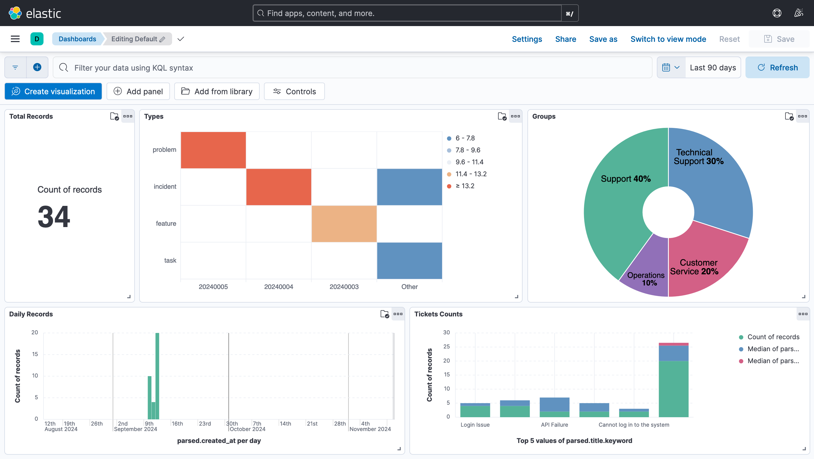

# ELK Deployment on AWS EKS

This repository describes the deployment of the ELK Stack (Elasticsearch, Logstash, and Kibana) on an Amazon EKS (Elastic Kubernetes Service) cluster using Terraform and Kubernetes manifests. 

Note: Another way to deploy ELK is to use AWS Opensearch Service.

## Prerequisites

Before deploying the ELK stack, ensure that you have the following installed and configured.

1. AWS CLI: Install the AWS CLI and configure it with the appropriate AWS credentials.

2. kubectl: Install kubectl for managing Kubernetes resources.
 
3. Helm: Install Helm to deploy Kubernetes applications.

4. Terraform: Install Terraform for provisioning AWS infrastructure.

5. eksctl: Install eksctl for creating and managing EKS clusters.

## Planning

### Terraform Modules

1. VPC Module: Provisions a custom VPC, subnets, and associated networking components.
2. EKS Module: Provisions an EKS cluster with managed node groups, IAM roles, and necessary permissions.

### ELK Kubernetes Manifests
1. Elasticsearch: Single-node or multi-node Elasticsearch cluster, persistent storage, and configuration.

2. Logstash: Configured to collect and ship logs to Elasticsearch.

3. Kibana: Accessible via an external IP (e.g., through a LoadBalancer service).

## EKS Setup

### Provision the EKS Cluster
The first step is to create the EKS cluster using the provided Terraform scripts.

Please create following if not exists
1. VPC (Virtual Private Cloud) and Subnets
2. Security group
3. IAM roles for for EKS control plane operations
4. KMS keys for volume data encryption
5. EKS Cluster

```
cd terraform
terraform init
terraform plan -var-file="terraform.tfvars"
terraform apply -var-file="terraform.tfvars"
```

### EKS k8s Configuration

### Key Management Service (KMS)
| **Attribute**             | **Details**                                         | **Used by**          |
|---------------------------|-----------------------------------------------------|----------------------|
| **S3 Access**             | brics-bi-s3-key                                     |                      |
| **EBS Encryption**        | brics-bi-k8s-ebs-key                                | attached volumes     |
| **ETCD Encryption**       | brics-bi-etcd-key                                   | brics-bi-k8s         |


### Identity and Access Management (IAM)
| **Attribute**             | **Details**                                         | **Used by**          |
|---------------------------|-----------------------------------------------------|----------------------|
| **EKS Cluster**           | brics-bi-cluster-role                               | brics-bi-k8s         |
| **Node Group IAM Role**   | brics_bi_node_group_role                            | brics-bi-workers     |
| **EKS EBS CSI Driver**    | bricsbiEksEbsCsiDriverRole                          | attached volumes     |


### VPC and Security Group
| **Attribute**             | **Details**                                         | **Used by**          |
|---------------------------|-----------------------------------------------------|----------------------|
| **VPC**                   | inet-accessible                                     | brics-bi-k8s         |
| **Security Group**        | frontdoor-default-sg                                | brics-bi-k8s         |


### Elastic Kubernetes Service (EKS)
| **Attribute**             | **Details**                                         |
|---------------------------|-----------------------------------------------------|
| **Cluster Name**          | brics-bi-k8s                                        |
| **Kubernetes Version**    | 1.30                                                |
| **VPC Module Version**    | 5.13.0                                              |
| **EKS Module Version**    | 20.24.0                                             |
| **Security Group**        | bi-k8s-security-group                               |
| **Access Method**         | Via Bastion Server and Direct Access                |
| **Namespace for ELK**     | bi-elk                                              |
| **StorageClass**          | bi-k8s-gp2 (Provisioner: kubernetes.io/aws-ebs)     |
| **VolumeBindingMode**     | WaitForFirstConsumer                                |
| **Add-ons**               | EBS CSI Driver                                      |
| **ELK Setup**             | Elasticsearch, Kibana, Logstash                     |
| **ELK Access**            | Kibana (Internet Access), Elasticsearch (Internal)  |
| **Current Status**        | Cluster Accessible, ELK Deployed                    |


### Access EKS

```
aws eks --region <region> update-kubeconfig --name <cluster-name>
```

## Deploy the ELK Stack
After the cluster is ready, deploy the ELK stack using Kubernetes manifests, suggested order: Kibana, ElasticSearch and Logstash. Apply files in following directory.

```
kubectl apply -f elk-k8s/kibana/
kubectl apply -f elk-k8s/elasticsearch/
kubectl apply -f elk-k8s/logstash/
```

### Access Kibana
Kibana can be accessed through the LoadBalancer’s external IP. Retrieve the IP from following command.

```
kubectl get svc -n <namespace>
```

### Configuration

To make ELK work, we need to configure them to make sure:

1. Logstash can send data to ElasticSearch
2. ElasticSearch can build index 
1. Kibana can access indexed data from ElasticSearch

### Elasticsearch
Configuration options (e.g., elasticsearch.yml) can be customized in the elasticsearch/ directory. So, prepare elasticsearch.yml and make sure it refers in the deployment, then redeploy.

```
kubectl apply -f elk-k8s/elasticsearch/
```

### Kibana 
Kibana is exposed externally via load balancer, will need to restrict access or enable additional security settings (e.g., HTTPS).

### Logstash 
Logstash configuration (logstash.conf) is essential to get data collected. And it is the central piece to diagnose ELK stack.

To have a customised configuration, apply configmap

```
kubectl apply -f elk-k8s/elasticsearch/logstash-configmap.yaml
kubectl apply -f elk-k8s/elasticsearch/logstash-deployment.yaml
```

To easily transfer data from bastion to pod volume, use a pvc-busybox to do so.

```
kubectl apply -f pvc-busybox.yaml
kubectl cp tickets.json pvc-busybox:/mnt/logstash/tickets.json -n bi-elk
```
After transfer, the data should be available for logstash pod at the /usr/share/logstash/tickets/

### Troubleshooting 

1. Kibana/Elasticsearch connectivity: Ensure that Kibana and Elasticsearch are deployed in the same namespace and that there are no firewall or network issues between them.

2. Persistent Volumes: Ensure that the EBS volumes are correctly bound to Elasticsearch and Logstash.

3. After data is transferred, watch logstash log to make sure it parses the file properly.

4. If logstash pushes data correctly to ElasticSearch, the index should be built, but it does take a few minutes. 

### Dashboard demo (dev data)


## Roadmap
- [x] Try AWS OpenSearch Service
- [x] Deploy Solution Assessment 
- [ ] Security Control Management
- [x] Connecting to Zammad API
- [ ] Connecting to Waldur API
- [ ] Dashboard Design
- [x] Explore Other Data Sources


# Amazon OpenSearch Service
This section is to use AWS OpenSearch Service (formerly known as Amazon Elasticsearch Service) for an ELK (Elasticsearch, Logstash, and Kibana) setup.

## Prerequisites

Create an IAM role and its policies for the domain as following:

| **Attribute**             | **Details**                                         |
|---------------------------|-----------------------------------------------------|
| **User**                  | elastic-master-user                                 |
| **Policies**              | AmazonESFullAccess, OpensearchAccess                |
| **Console access**        | Disabled                                            |
| **Access Key 1**          | Created                                             |

## Create a Domain 

Follow this [link](https://docs.aws.amazon.com/opensearch-service/latest/developerguide/gsgcreate-domain.html) to create OpenSearch Service domain


## Set up OpensearchAccess Policy for IAM role

Set up rule as following for IAM user:
```json
{
	"Version": "2012-10-17",
	"Statement": [
		{
			"Effect": "Allow",
			"Action": [
				"es:ESHttpGet",
				"es:ESHttpPost",
				"es:ESHttpPut",
				"es:ESHttpDelete"
			],
			"Resource": "arn:aws:es:<Your-Region>:<Your-Account>:<Your-Domain>>*"
		}
	]
}
```

## Use Kibana Signer Extension to Access Portal

For IAM-based access to OpenSearch, we use IAM policies and AWS Signature Version 4 signing to authenticate requests made to the OpenSearch dashboard.

1. Install the AWS Signer Browser extension for your browser (available for Chrome and Firefox).

2. Open the extension settings and provide your AWS Access Key and Secret Key for the IAM user you are using to access OpenSearch.

3. After configuring the credentials in the extension, try accessing the OpenSearch dashboard again. The extension will sign your requests automatically using AWS SigV4.

| **Attribute**             | **Details**                                         |
|---------------------------|-----------------------------------------------------|
| **Key**                   | Your-IAM-User-Key                                   |
| **Secret**                | Your-IAM-User-Secret                                |
| **Host Patterns**         | https://your-Opensearch-domain.aws/*                |
| **Defined Services**      | See below                                           |

Set defined services:
```json
[
    {
        "region": "your-region",
        "service": "es",
        "host": "*"
    }
]
```

## Create an Index (use opensearch.py)

```shell
cd scripts
cp example.env .env
```

Set credentials variables in .env file, and then set up python env to run

```shell
cd scripts
python3 -m venv env
source env/bin/activate
pip3 install -r requirements.txt
python3 opensearch.py create-index --index zammad-dev-tickets
```

Then check if index is created via cmd or AWS OpenSearch portal

```shell
curl https://<your-opensearch-domain>/_cat/indices?v 
```

### Download data from a data source (e.g. zammad, use zammad.py)
```shell
cd scripts
source env/bin/activate
python3 zammad.py get-tickets --output ../data/zammad-dev.json
```

### Upload a json file to an Index (use opensearch.py)
```shell
cd scripts
source env/bin/activate
python3 zammad.py get-tickets --output ../data/zammad-dev.json
python3 opensearch.py upload-file --index zammad-dev-tickets --file ../data/zammad-dev.json
```

### Covert CSV to JSON (use opensearch.py)
```shell
cd scripts
source env/bin/activate
python3 opensearch.py csv-to-json --csv my-file.csv --json my-file.json
```

Then use upload-file command to update the json file to the index.

### Check index documents
```shell
curl https://<your-opensearch-domain>/zammad-dev-tickets/_search
```

### Clear index data
Sometime the index upload creats duplicates, you can clear the index before upload a new file.
```shell
python3 opensearch.py clear-index --index zammad-dev-tickets
```